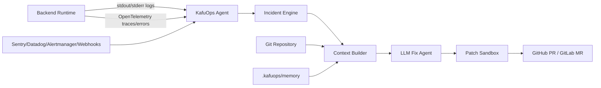

<p align="center">
  <a href="https://kalmuraee.github.io/KafuOps/">
    
  </a>
</p>

<p align="center">
  <strong>Turn backend incidents into evidence-backed merge requests.</strong>
</p>

<p align="center">
  <a href="https://github.com/Kalmuraee/KafuOps/actions/workflows/ci.yml"></a>
  <a href="https://github.com/Kalmuraee/KafuOps/releases"></a>
  <a href="LICENSE"></a>
  <a href="STATUS.md"></a>
  <a href="https://kalmuraee.github.io/KafuOps/"></a>
</p>

---

**KafuOps** is an open-source production-debugging agent for backend teams. It connects to your repository and observability signals, learns the structure of your backend, and turns real production incidents into evidence-backed merge requests.

KafuOps is designed around one important rule:

> It does not stream all logs to an LLM. It watches locally, detects meaningful incidents, builds a small sanitized evidence packet, grounds the model with only the relevant files, and opens a reviewable MR or PR.

> 📋 **Looking for the honest picture of what works today vs. what is spec only?**
> See [STATUS.md](STATUS.md) — every doc in `docs/` is mapped to ✅ implemented, 🟡 partial, or 🔲 not yet.

## See it fix a real bug

A planted bug in a tiny checkout service — KafuOps diagnoses it, writes the patch, **self-corrects when the first attempt fails**, validates the fix in a sandbox, and opens a reviewable MR. This run is driven by the locally-installed **Claude CLI** (no API key).

<p align="center">
  <a href="https://kalmuraee.github.io/KafuOps/"></a><br>
  <em>▶ <a href="https://kalmuraee.github.io/KafuOps/">Watch the animated demo on the site</a> · reproduce locally with <code>scripts/demo.sh</code></em>
</p>

The fix KafuOps generated, after the sandbox test went green:

```diff
- return price - price * percent;
+ return price - price * (percent / 100);
```

```
$ scripts/demo.sh
### Before — the test fails (red):
AssertionError: 20% off $100 should be $80   (-1900 !== 80)

### KafuOps runs (provider: claude CLI):
! attempt 1: patch did not apply → revise → retry
✓ attempt 2: patch applied, tests passed        # self-correcting loop
  confidence=80 (high)   risk=low
! MR ready for review — saved mr-body.md

### After — the test passes (green):
all tests passed
```

## What KafuOps does

- Observes backend logs (wrapper mode + sidecar file tailing), OpenTelemetry traces, runtime errors, and alert webhooks (Sentry/Datadog/Alertmanager).
- Builds a living `.kafuops/memory/` folder that explains the codebase, architecture, routes, services, database usage, queues, external APIs, and previous incidents.
- Detects errors and deduplicates noisy events into incidents.
- Selects the relevant source files, tests, configs, traces, and log snippets.
- Calls an LLM only after an incident trigger and only with sanitized context.
- Generates a failing regression test when possible.
- Creates a fix in a sandbox branch.
- Runs configured tests.
- Opens a GitHub PR or GitLab MR with root cause, evidence, confidence score, blast radius, and validation notes.
- Updates project memory after review and merge.

## Recommended architecture

For production, KafuOps should run **beside** your backend, not inside it.

The default mode is a **sidecar/agent + control-plane worker** model:



This keeps your app in control of its own runtime and makes KafuOps easy to adopt without becoming the process manager for production.

For local development and staging, KafuOps can also wrap the backend command:

```bash
kafuops run -- npm run dev
kafuops run -- python -m uvicorn app.main:app
kafuops run -- ./gradlew bootRun
```

That mode captures stdout/stderr, process exits, stack traces, and runtime metadata directly.

## Quick start

```bash
cd your-backend-repo
npx kafuops quickstart      # discover the stack, set up, build memory — one command
kafuops run -- npm start    # wrap your app and watch for incidents
```

`quickstart` auto-detects your framework, start command, git remote, and which AI
is available (it'll use a local **Codex/Claude CLI** with no API key, or an
OpenAI/Anthropic key). Your key is stored in `.kafuops/.env` (gitignored, mode
0600) and **loaded automatically** — no manual `export` needed. Run `kafuops
doctor` any time to check the setup.

Or for production-style setup:

```bash
kafuops init
kafuops agent start --config .kafuops.yml
kafuops worker start --config .kafuops.yml
```

## Core design principles

1. **Incident-triggered AI** — no continuous log streaming to the model.
2. **Small grounded context** — send only the files and evidence needed for this incident.
3. **Human-reviewable output** — every MR includes evidence, risk, tests, and confidence.
4. **Memory-first debugging** — every incident improves the project memory.
5. **Privacy by default** — redaction, file allowlists, audit logs, and local-first processing.
6. **No auto-merge by default** — KafuOps opens reviewable MRs, not silent production changes.

## Documentation

Start here:

- [Documentation index](docs/INDEX.md)
- [Product brief](PRODUCT_BRIEF.md)
- [Architecture](docs/ARCHITECTURE.md)
- [Setup wizard](docs/SETUP_WIZARD.md)
- [Runtime modes](docs/RUNTIME_MODES.md)
- [Error-triggered LLM design](docs/ERROR_TRIGGERED_LLM.md)
- [Project memory](docs/PROJECT_MEMORY.md)
- [Security and privacy](docs/SECURITY_PRIVACY.md)
- [Landing page copy](website/HOME.md)

## Status

The 0.1.0 MVP is implemented as a Node.js/TypeScript package in this repository:

```
src/         agent, incident engine, scanner, graph, context builder, LLM
             orchestrator, sandbox, MR/PR creator, webhooks, policies, CLI
tests/       vitest unit tests
bin/kafuops  CLI entry point
Dockerfile   multi-stage build
examples/    a tiny sample-app to exercise the wrapper-mode incident flow
```

Quick local check:

```bash
npm install
npm run build
npm test
node bin/kafuops.js --help
```

The MVP follows the success criteria in [PRODUCT_BRIEF.md](PRODUCT_BRIEF.md):
GitHub + GitLab MR creation, OpenAI-grounded analysis, sanitized context
bundles, grounding manifest per call, redaction at ingest and before model
calls, regression-test-first sandbox validation, confidence + blast-radius
scoring, and audit logging of every model call. The implementation runs in
**dry-run mode** automatically when `OPENAI_API_KEY` or `KAFUOPS_GIT_TOKEN` are
absent, so the full pipeline can be exercised offline.

As of 0.2.0 the agent observes a live system (sidecar log tailing + OpenTelemetry
OTLP intake), the `worker` autonomously drives incidents to MRs, and the
review-feedback memory loop is closed. The documentation in `docs/` and
`website/` remains the canonical product specification — anything not implemented
yet (first-class Kubernetes operator/CRD, embedded SDKs, similar-incident
matching) is on the roadmap in [docs/ROADMAP.md](docs/ROADMAP.md). See
[STATUS.md](STATUS.md) for the honest doc-by-doc mapping.
