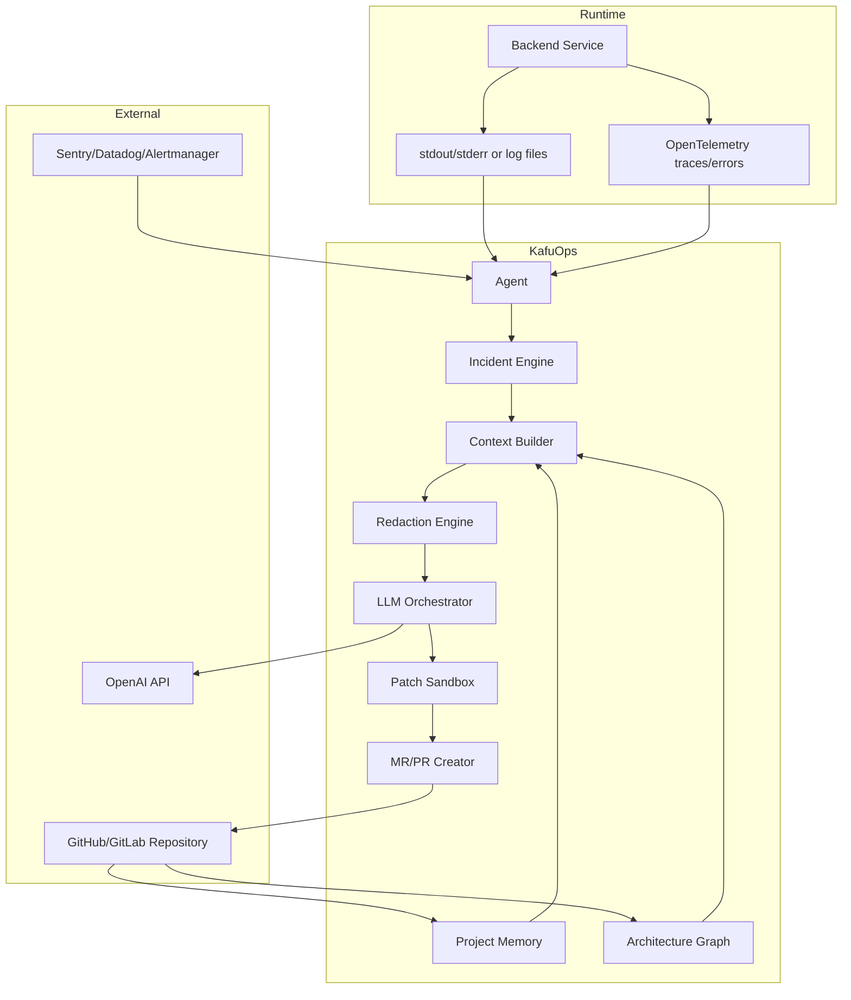
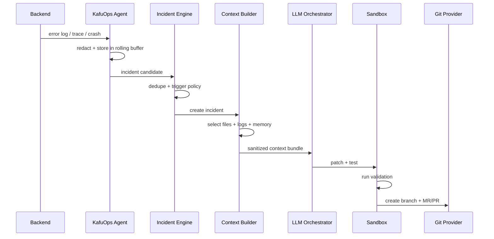

# Architecture

KafuOps is built as a modular observability-to-fix pipeline.

## Recommended production architecture

KafuOps should not become the production process manager for the backend by default. Instead, it should run as an adjacent agent that observes runtime signals and calls a separate worker for analysis and patch generation.



## Components

### Agent

The agent runs near the backend runtime. It collects logs, traces, alerts, stack traces, process events, and environment metadata.

Responsibilities:

- Maintain a local rolling buffer of logs.
- Normalize runtime events.
- Redact sensitive values early.
- Detect error patterns.
- Send incident candidates to the incident engine.

### Incident engine

The incident engine decides whether an observed event is important enough to analyze.

Responsibilities:

- Deduplicate repeated errors.
- Group related events by stack trace, route, trace ID, service, deployment, and time window.
- Apply trigger policies.
- Create incident records.
- Avoid model calls for noise.

### Repository scanner

The scanner reads the repository and builds project memory.

Responsibilities:

- File tree summary.
- Framework detection.
- Route discovery.
- Service/module discovery.
- Test file mapping.
- Database and migration detection.
- Queue and event consumer detection.
- External API/client detection.

### Architecture graph

The architecture graph maps how backend pieces connect.

Examples:

```text
route -> controller -> service -> repository -> database table
queue -> consumer -> handler -> external API
cron -> job -> model -> table
```

### Context builder

The context builder creates a small grounding bundle for the incident.

Inputs:

- Stack trace.
- Error message.
- Trace spans.
- Relevant log excerpts.
- Recent deploy/commit info.
- Architecture graph neighbors.
- Relevant source files.
- Nearby tests.
- Project memory.

Output:

```text
.kafuops/incidents/<id>/context-bundle.json
.kafuops/incidents/<id>/grounding-manifest.md
```

### LLM orchestrator

The orchestrator calls the model in structured stages:

1. Root-cause analysis.
2. File selection validation.
3. Test generation plan.
4. Patch plan.
5. Code patch generation.
6. MR explanation generation.

It should treat logs and user-controlled strings as data, not instructions.

### Patch sandbox

The sandbox applies model-generated changes in an isolated branch or container.

Responsibilities:

- Apply patches.
- Generate tests.
- Run install command.
- Run targeted tests.
- Run full test suite if configured.
- Capture validation output.

### MR/PR creator

The MR creator opens a reviewable change with evidence.

It should include:

- Incident summary.
- Root cause.
- Evidence.
- Files inspected.
- Files changed.
- Tests run.
- Confidence score.
- Blast radius.
- Grounding manifest.
- Rollback notes.

## Data flow



## Why sidecar is the default

Sidecar mode is preferred because:

- It avoids changing how production starts the backend.
- It supports many languages and frameworks.
- It can be deployed gradually.
- It limits blast radius if KafuOps fails.
- It works with existing logs and OpenTelemetry.

## Why wrapper mode still exists

Wrapper mode is useful for local development and staging:

```bash
kafuops run -- npm start
```

It gives KafuOps stronger visibility into process exits, stdout/stderr, and runtime metadata. It should be optional in production.
