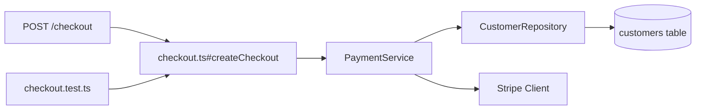

# Architecture Graph

The architecture graph is KafuOps' structured understanding of how the backend works.

It connects runtime incidents to source code.

## What the graph models

```text
routes
controllers
services
repositories
models
database tables
migrations
queues
consumers
cron jobs
external APIs
tests
configuration
feature flags
```

## Example graph



## Why the graph matters

When an error occurs in `PaymentService`, KafuOps can inspect:

- The route that triggered it.
- The controller that called it.
- The data model involved.
- The external dependency involved.
- The nearest tests.
- Previous incidents in the same path.

This makes context selection much better than simple keyword search.

## Graph sources

KafuOps can build the graph from:

- Static code analysis.
- Import graphs.
- Framework route definitions.
- ORM models.
- Migration files.
- Queue configuration.
- OpenTelemetry traces.
- Runtime stack traces.
- Project memory.
- Human corrections.

## Graph output

Store graph snapshots in:

```text
.kafuops/memory/architecture-graph.json
.kafuops/memory/architecture-graph.md
```

Example JSON:

```json
{
  "nodes": [
    {
      "id": "route:POST /checkout",
      "type": "route",
      "label": "POST /checkout"
    },
    {
      "id": "file:src/routes/checkout.ts",
      "type": "file",
      "label": "src/routes/checkout.ts"
    }
  ],
  "edges": [
    {
      "from": "route:POST /checkout",
      "to": "file:src/routes/checkout.ts",
      "type": "handled_by"
    }
  ]
}
```

## Context selection algorithm

For an incident:

1. Start from top stack frame.
2. Add the file containing the failing function.
3. Add graph neighbors within distance 1 or 2.
4. Add tests linked to changed files.
5. Add memory records for similar fingerprints.
6. Add config only when stack trace or code references it.
7. Exclude denied paths.
8. Rank by evidence strength.

## Evidence strength ranking

High:

- Top stack frame file.
- File changed in suspected deploy.
- File directly referenced by trace span.
- Test file covering failing function.

Medium:

- Direct dependency of failing file.
- Route handler connected to failing service.
- Memory file for similar incident.

Low:

- Generic framework files.
- Large unrelated modules.
- Documentation.
- Distant graph neighbors.
