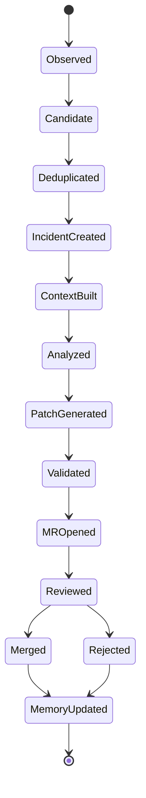

# Incident Workflow

An incident is the central unit of work in KafuOps.

## Lifecycle



## Step 1: Observe

KafuOps receives an event:

- Error log.
- Stack trace.
- Trace span with error status.
- Process crash.
- Alert webhook.
- Manual incident command.

## Step 2: Deduplicate

Repeated errors are grouped.

Deduplication keys:

```text
service
environment
exception type
normalized message
top stack frame
route/job
trace fingerprint
deployment version
```

## Step 3: Create incident

An incident is created only if trigger rules match.

Example:

```json
{
  "id": "inc_123",
  "status": "created",
  "service": "api-service",
  "environment": "production",
  "severity": "high",
  "fingerprint": "payment_retry_missing_default_method",
  "first_seen": "2026-05-15T10:24:00Z",
  "last_seen": "2026-05-15T10:30:00Z",
  "event_count": 18
}
```

## Step 4: Build evidence packet

The evidence packet includes:

- Incident summary.
- Stack trace.
- Trace ID and selected spans.
- Relevant logs around the error.
- Runtime metadata.
- Deploy/commit metadata.
- Related previous incidents.
- Architecture graph path.

## Step 5: Build context bundle

The context bundle includes evidence plus selected files.

It should be small enough to be useful and safe enough to audit.

## Step 6: Analyze root cause

The model classifies the incident and determines whether a code MR is appropriate.

Possible classifications:

```text
code_bug
configuration_issue
missing_environment_variable
third_party_outage
database_migration_issue
schema_mismatch
data_quality_issue
insufficient_telemetry
unknown
```

## Step 7: Generate fix

If appropriate, KafuOps attempts:

1. Regression test.
2. Minimal patch.
3. Test execution.
4. MR creation.

## Step 8: Open MR/PR

The MR should be reviewable, not magical.

It must include:

- Why the MR exists.
- What production evidence triggered it.
- What files were inspected.
- What changed.
- What tests ran.
- What could break.
- How to roll back.

## Step 9: Learn from review

After the MR is merged or rejected, KafuOps updates memory.

Examples:

```text
Reviewer accepted root cause.
Reviewer corrected root cause.
Reviewer asked for different test.
Reviewer rejected because config change was better than code fix.
```

## Manual commands

```bash
kafuops incidents list
kafuops incidents show inc_123
kafuops incidents analyze inc_123
kafuops incidents build-context inc_123
kafuops incidents open-mr inc_123
kafuops incidents mark-resolved inc_123
```
